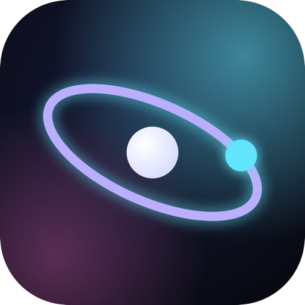
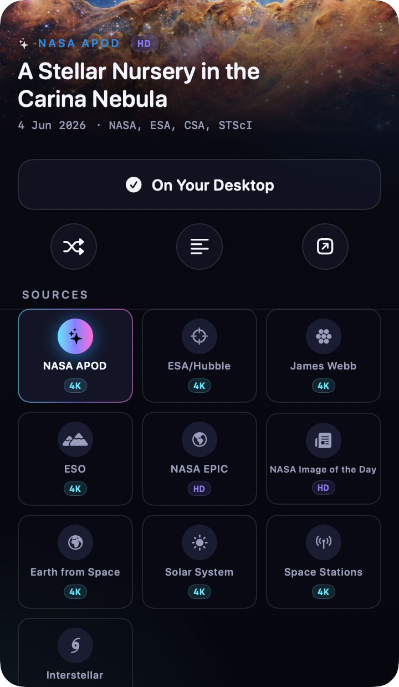

<div align="center">



# Caelum

### The cosmos, every day, on your desktop.

A beautifully designed macOS **menu-bar app** that quietly keeps the latest **NASA Astronomy Picture of the Day** as your wallpaper — with **10 stellar sources** and a cinematic **ambient mode**.

[](https://github.com/ProfessorEngineergit/caelum/releases/latest)
&nbsp;
[](https://ko-fi.com/professorengineergit)
&nbsp;
[](https://professorengineergit.github.io/caelum/)


[](https://github.com/ProfessorEngineergit/caelum/actions/workflows/release.yml)

<br/>



</div>

---

## ✦ What is Caelum?

Caelum lives entirely in your **menu bar** — no Dock icon, no windows, no clutter. Every day it
fetches the latest **Astronomy Picture of the Day** from NASA and sets it as your desktop
wallpaper, automatically, in the background. Click the orbit glyph in your menu bar and a panel of
frosted obsidian glass floats over your desktop, where you can switch between **ten** image
libraries, read the day's explanation, or kick off a full-screen **ambient** slideshow.

It's designed around a single idea: **the interface should wear the colours of the cosmos.** Caelum
extracts the dominant colour of each image and re-tints its own accents to match.

## ✦ Features

- **Always the latest APOD** — fetched daily and set as your wallpaper, automatically. Robust even
  when NASA's API is down (Caelum transparently falls back to the APOD website).
- **10 stellar sources** — APOD is the star, joined by ESA/Hubble, James Webb, ESO, NASA EPIC,
  the NASA Image Library, Bing, Wikimedia, NASA Image of the Day, and a hand-curated gallery.
- **Cinematic ambient mode** — a full-screen, multi-display ken-burns slideshow on idle. Your own
  planetarium. Move the mouse to return.
- **Menu-bar only** — `LSUIElement`, zero Dock footprint.
- **The UI wears the cosmos** — dynamic accent colour extracted from each image.
- **Multi-display** — sets the wallpaper on every screen.
- **Smart downloads** — huge gigapixel images (yes, APOD does this) are automatically capped to a
  sensible size for wallpaper.
- **Instant switching** — all source libraries are pre-cached in the background so any click is
  immediate, with no on-demand download delay.
- **Private & open source** — no accounts, no tracking, no analytics whatsoever. Images come
  straight from public APIs. MIT-licensed.

## ✦ The ten sources

| # | Source | What you get | API key |
|---|--------|--------------|---------|
| ⭐ | **NASA APOD** | The Astronomy Picture of the Day | bundled `DEMO_KEY` (optional personal key) |
| 2 | **ESA/Hubble** | Hubble Picture of the Week | — |
| 3 | **James Webb** | ESA/Webb image releases | — |
| 4 | **ESO** | European Southern Observatory Picture of the Week | — |
| 5 | **NASA EPIC** | Full-disk Earth from the DSCOVR spacecraft | shares NASA key |
| 6 | **NASA Library** | NASA Image & Video Library (rotating queries) | — |
| 7 | **Bing** | Bing Photo of the Day (4K) | — |
| 8 | **Wikimedia** | Wikimedia Commons Picture of the Day | — |
| 9 | **NASA Image of the Day** | NASA's curated daily feed | — |
| 10 | **Caelum Curated** | A hand-picked gallery of the finest space imagery, refreshed OTA — no app update needed | — |

Everything works out of the box. The bundled NASA `DEMO_KEY` is rate-limited; drop a free personal
key (from [api.nasa.gov](https://api.nasa.gov)) into **Settings** for higher limits.

## ✦ Install

### Homebrew (recommended)

```sh
brew tap ProfessorEngineergit/caelum
brew install --cask caelum
```

Homebrew handles Gatekeeper automatically — no quarantine steps needed.

### Manual

1. **Download** the latest `Caelum.zip` from the [**Releases**](https://github.com/ProfessorEngineergit/caelum/releases/latest) page and unzip it into `/Applications`.
2. **Right-click → Open.** Caelum is free and open source, so it isn't notarized by Apple. On first
   launch, right-click the app and choose **Open** to get past Gatekeeper (you only do this once).
   <br/>If macOS still refuses, run:
   ```bash
   xattr -dr com.apple.quarantine /Applications/Caelum.app
   ```
3. **Find the star** — the orbit glyph appears in your menu bar. Click it, pick a source, and fly.

> **Requirements:** macOS 13 (Ventura) or later.

## ✦ Usage

- **Click** the menu-bar glyph to open the panel.
- **Set as Wallpaper** applies the current image to every display.
- **Shuffle** pulls the next image from the active source.
- **Sources strip** switches between the ten libraries.
- **Explanation** opens the day's write-up.
- **Footer:** Settings · Ambient mode · Refresh · Quit.
- **Right-click** the menu-bar glyph for a quick menu (Refresh / Ambient / Quit).

### Settings

| Setting | Default | Description |
|---------|---------|-------------|
| Refresh daily automatically | on | Fetch & apply the newest image each day (and on wake). |
| Set on all displays | on | Apply to every screen. |
| Rotate through the library | off | Cycle images every _N_ minutes. |
| Tint interface to the image | on | Dynamic accent colour. |
| Chime when wallpaper updates | on | A subtle sound on update. |
| Launch at login | off | Start Caelum automatically (`SMAppService`). |
| NASA API key | `DEMO_KEY` | Your personal key for higher rate limits. |

## ✦ How it works

Caelum is a native **Swift 6 + AppKit + SwiftUI** app, built with the **Swift Package Manager**
(no `.xcodeproj` required).

```
Sources/Caelum/
├── App/        main · AppDelegate · StatusItemController (glass panel) · AmbientController · AppState
├── Core/       CosmicImage · ImageSource · SourceRegistry · ImageCache · WallpaperManager · Prefetcher
│   ├── Net/    HTTPClient (retry/backoff) · RSSParser
│   └── Sources/  APOD · Djangoplicity (Hubble/Webb/ESO) · EPIC · NASA Library · Bing · Wikimedia · NASA IOTD · Curated
└── UI/         Theme (the design system) · GlassBackground · HeroView · ControlDeck · SourceStrip · ExplanationSheet · SettingsView · OrbitalLoader · AmbientView
```

- **Wallpaper** uses the documented `NSWorkspace.setDesktopImageURL(_:for:options:)` per `NSScreen`.
- **Ambient mode** presents borderless full-screen windows on every display and keeps the display
  awake with an `IOPMAssertion`.
- **Idle detection** uses `CGEventSource` input timestamps.
- **Background prefetching** caches previews for every image in every source so any click is instant, with no on-demand download.
- **Adding a source** is one file conforming to `ImageSource` + one line in `SourceRegistry`.

### The design language — *Obsidian Glass / Aurora*

A precision instrument carved from black glass that carries the cosmos: layered vibrancy, a luminous
hairline, the aurora gradient (cyan → violet → magenta) used sparingly, instrument typography with
tabular figures, and spring-based "orbital" motion throughout. The full system lives in
[`Theme.swift`](Sources/Caelum/UI/Theme.swift).

## ✦ Build from source

```bash
git clone https://github.com/ProfessorEngineergit/caelum.git
cd caelum

# Run the source smoke-test (fetches the latest image from all 10 sources)
swift run Caelum --smoke-test

# Build a signed .app bundle into dist/
bash scripts/build-app.sh release
open dist/Caelum.app
```

| Script | Purpose |
|--------|---------|
| `scripts/build-app.sh [debug\|release] [--universal]` | Compile + assemble `dist/Caelum.app`, ad-hoc signed. |
| `scripts/make-icon.sh` | Render the app icon and build `AppIcon.icns`. |
| `scripts/render-icon.swift` | Draw the brand mark (used by `make-icon.sh`). |

Releases are built automatically by GitHub Actions on every `v*` tag (see
[`.github/workflows/release.yml`](.github/workflows/release.yml)).

## ✦ What's coming

- **OTA curated gallery packs** — new themed image collections will be pushed over-the-air without
  requiring an app update. New packs appear automatically in your Caelum Curated source.
- **More sources** — expanding the library with additional space agencies and observatories.
- **Contributions welcome** — see [Contributing](#-contributing) below.

## ✦ Privacy

Caelum is designed to collect absolutely nothing about you. Here is the complete list of every
network request Caelum ever makes — there are no others:

| Request | When | Who receives it | Why |
|---------|------|-----------------|-----|
| `api.nasa.gov/planetary/apod` | Daily / on launch | NASA | Fetch APOD metadata |
| `apod.nasa.gov` (HTML fallback) | When API fails | NASA | Scrape APOD image if the API is down |
| `hubblesite.org/api/…` | On source load | STScI / NASA | Hubble image feed |
| `esawebb.org/rss/…` | On source load | ESA | Webb image feed |
| `eso.org/public/images/…` | On source load | ESO | ESO image feed |
| `api.nasa.gov/EPIC/…` | On source load | NASA | Earth imagery |
| `images-api.nasa.gov/…` | On source load | NASA | NASA Image Library |
| `www.bing.com/HPImageArchive.aspx` | On source load | Microsoft | Bing Photo of the Day |
| `commons.wikimedia.org/…` | On source load | Wikimedia Foundation | Picture of the Day |
| `www.nasa.gov/rss/…` | On source load | NASA | NASA Image of the Day feed |
| Image files from the above domains | On demand | Same as above | Download images for wallpaper |

**That is everything.** There is no telemetry, no crash reporting, no usage analytics, no tracking
pixels, no third-party SDKs, and no sign-in of any kind. Caelum never phones home. The app has no
server of its own — it is a thin client that talks directly to the public APIs listed above, and
only to those APIs.

Images are cached in `~/Library/Application Support/Caelum/Cache` on your local disk. This
directory is never read by anyone but you and Caelum.

The future OTA gallery feature works the same way: Caelum will fetch a static JSON file from this
GitHub repository's releases. The file is a plain list of image URLs — no personal data is sent or
received. You can inspect the file here at any time.

## ✦ Contributing

Contributions are very welcome. The most impactful thing you can do is **add a new image source**:

1. Create a file in `Sources/Caelum/Core/Sources/` conforming to `ImageSource`.
2. Register it with one line in `SourceRegistry.swift`.
3. Open a pull request.

For bug reports and feature requests, please use [GitHub Issues](https://github.com/ProfessorEngineergit/caelum/issues).

## ✦ Support

Caelum is free and open source. If it brings a little wonder to your day, a small Ko-fi helps cover
the time spent building it and keeps future development going:

[](https://ko-fi.com/professorengineergit)

## ✦ Credits & License

Caelum is **MIT-licensed** — see [LICENSE](LICENSE).

Astronomical imagery is provided by **NASA**, **ESA**, **ESO**, the **Hubble** and **James Webb**
Space Telescope teams, **Bing**, and **Wikimedia Commons**, and remains the property of its
respective owners under each provider's terms. Caelum is an independent project and is **not**
affiliated with or endorsed by NASA, ESA, or ESO.

<div align="center">
<br/>
Made for the love of the night sky.
</div>
